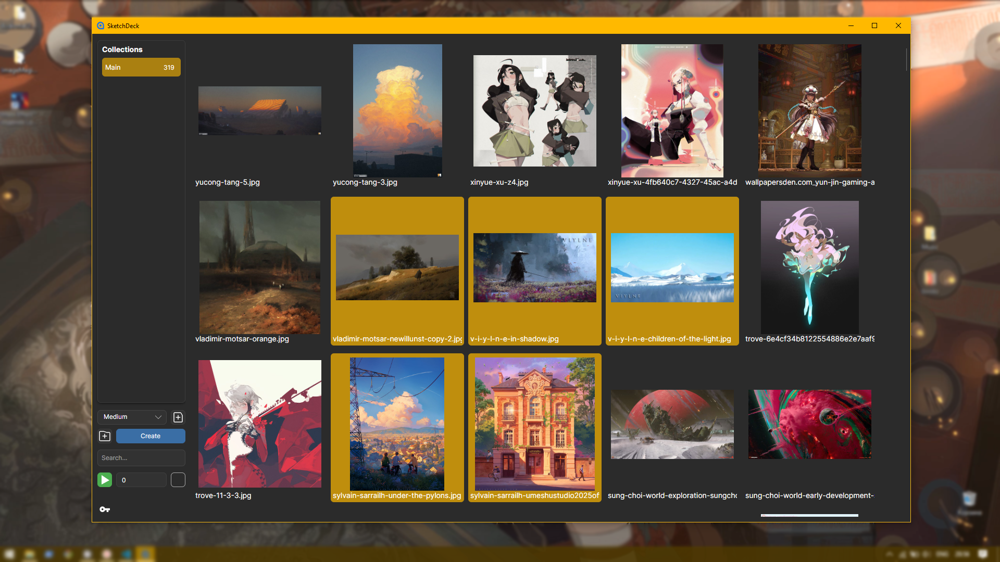

#  Sketch Deck

A simple picture viewer built with [Avalonia UI](https://avaloniaui.net/).
It’s a small offline app where you can create decks of images, set a timer, shuffle them, and view them the way you want.
Just a side project I made for myself. It’s open-source and free to use!.

## OS
* Tested only on windows 10. But 90% of the programm should work on others too(theoretically) 

## Download
* If you just want to try it out, grab the latest .exe from the Releases page.

## Features
<div style="display: flex; flex-wrap: wrap; gap: 20px; justify-content: center;">
  
</div>

## Run

You’ll need [.NET 8](https://dotnet.microsoft.com/download). Then:

```bash
git clone https://github.com/yourusername/picture-deck-viewer.git
cd sketchDeck
dotnet run || dotnet watch
```

## License
Free and open-source under the MIT License.
